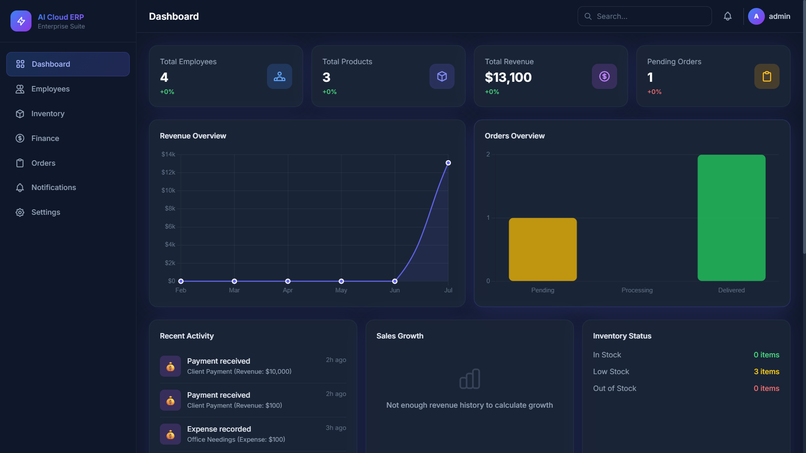
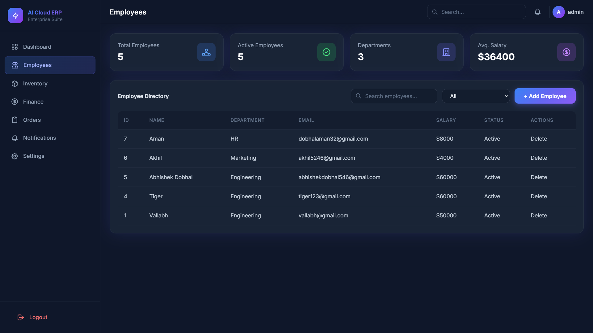
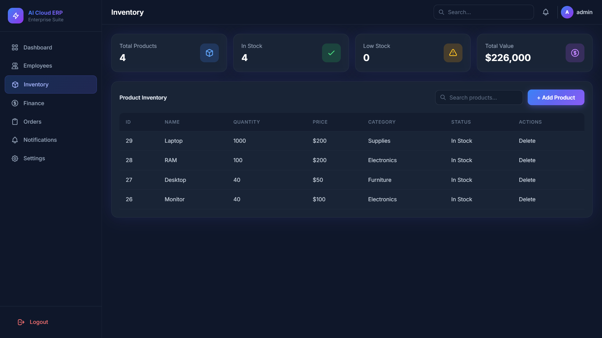
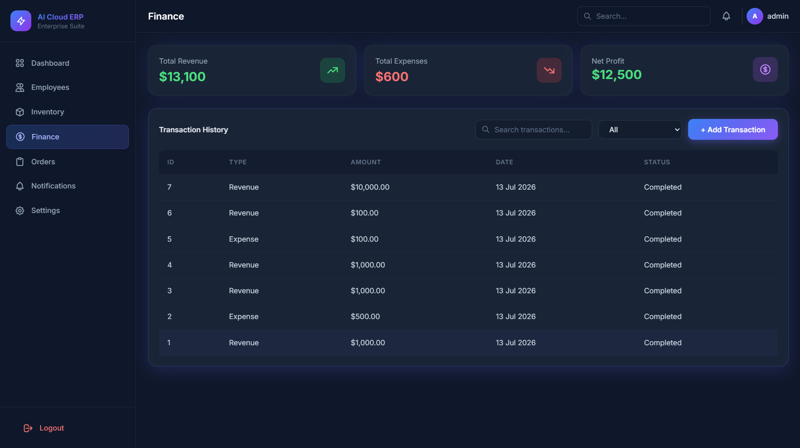
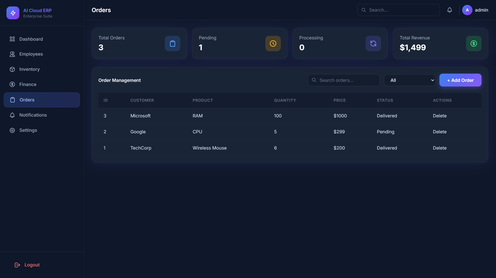
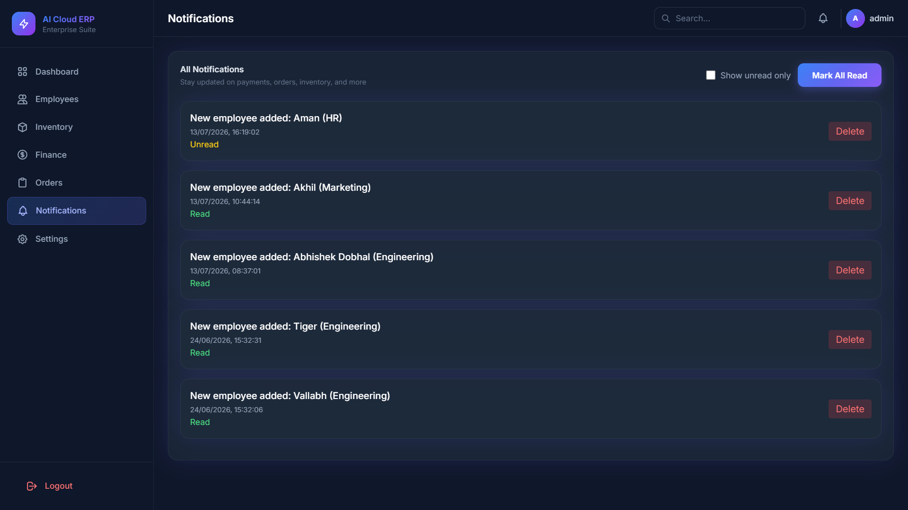
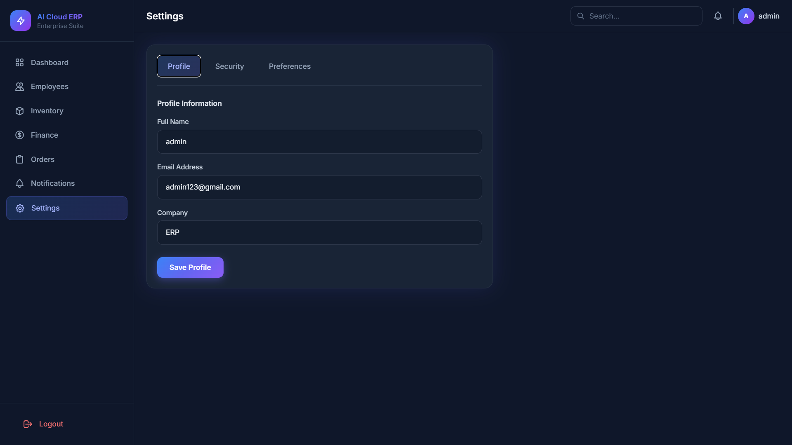

<p align="center">
  
</p>

<h1 align="center">AI Cloud ERP Suite</h1>

<p align="center">
A full-stack Enterprise Resource Planning (ERP) web application built using Node.js, Express.js, PostgreSQL, HTML, CSS, and JavaScript.
</p>

<p align="center">


</p>

---

# About

AI Cloud ERP Suite is a full-stack ERP web application developed to understand real-world backend development, REST APIs, authentication, database management, and frontend integration.

The application combines multiple business modules into a single platform, allowing users to manage employees, inventory, finance, orders, notifications, and business analytics through a modern dashboard.

The project follows a modular architecture where the frontend communicates with REST APIs built using Express.js, while PostgreSQL (Supabase) is used for persistent data storage.

---

# Features

## Authentication

- User Registration
- User Login
- JWT Authentication
- Protected Routes
- Secure Logout
- Browser Back Button Protection
- Password Show / Hide Toggle

---

## Dashboard

- Business Analytics
- Revenue Overview Chart
- Orders Overview Chart
- Sales Growth
- Inventory Status
- Recent Activities
- Department Distribution
- Live Statistics

---

## Employee Management

- Add Employee
- Update Employee
- Delete Employee
- Search Employees
- Department Filter
- Employee Status

---

## Inventory Management

- Add Products
- Update Products
- Delete Products
- Automatic Stock Status
- Product Search

---

## Finance Module

- Revenue Tracking
- Expense Tracking
- Profit Calculation
- Transaction Filters
- Search Transactions

---

## Orders Module

- Create Orders
- Update Orders
- Delete Orders
- Order Status Tracking
- Search Orders

---

## Notifications

- View Notifications
- Mark All as Read
- Delete Notifications

---

## Settings

- User Profile
- Change Password
- User Preferences

---

## User Experience

- Responsive Design
- Modern Glassmorphism UI
- Interactive Charts
- Toast Notifications
- Loading Overlay
- Password Visibility Toggle
- Smooth Page Navigation

---

# Screenshots

## Dashboard


---

## Employees



---

## Inventory



---

## Finance



---

## Orders



---

## Notifications



---

## Settings



---

# System Architecture

```
                        Browser

                            │

             HTML • CSS • JavaScript

                            │

                Express.js REST APIs

                            │

               JWT Authentication Layer

                            │

             PostgreSQL Database (Supabase)
```

---

# Technology Stack

| Category | Technologies |
|-----------|--------------|
| Frontend | HTML5, CSS3, JavaScript (ES6), Tailwind CSS |
| Backend | Node.js, Express.js |
| Database | PostgreSQL (Supabase) |
| Charts | Chart.js |
| Authentication | JWT |
| Version Control | Git, GitHub |
| API Testing | Thunder Client |
| Editor | Visual Studio Code |

---

# Project Structure

```
AI-Cloud-ERP-Suite
│
├── backend
│   ├── config
│   ├── controllers
│   ├── middleware
│   ├── routes
│   ├── services
│   ├── utils
│   ├── database
│   ├── server.js
│   ├── package.json
│   └── .env
│
├── erp-frontend
│   ├── css
│   ├── js
│   ├── assets
│   ├── login.html
│   ├── signup.html
│   ├── dashboard.html
│   ├── employees.html
│   ├── inventory.html
│   ├── finance.html
│   ├── orders.html
│   ├── notifications.html
│   └── settings.html
│
├── screenshots
│   ├── dashboard.png
│   ├── employees.png
│   ├── inventory.png
│   ├── finance.png
│   ├── orders.png
│   ├── notifications.png
│   └── settings.png
│
└── README.md
```

---

# REST API Modules

| Module | Description |
|----------|-------------|
| Authentication | User Login & Registration |
| Dashboard | Analytics & Business Insights |
| Employees | Employee CRUD Operations |
| Inventory | Inventory Management |
| Finance | Revenue & Expense Management |
| Orders | Order Management |
| Notifications | Notification System |
| Settings | User Profile & Preferences |

---

# Installation

## Clone Repository

```bash
git clone https://github.com/YOUR_USERNAME/AI-Cloud-ERP-Suite.git
```

Move to the backend folder.

```bash
cd backend
```

Install dependencies.

```bash
npm install
```

Create a `.env` file.

```env
PORT=5000

DB_HOST=YOUR_HOST
DB_PORT=5432
DB_NAME=postgres
DB_USER=YOUR_USER
DB_PASSWORD=YOUR_PASSWORD

JWT_SECRET=YOUR_SECRET
```

Start the backend server.

```bash
npm run dev
```

Open the `erp-frontend` folder using Live Server.

---

# Environment Variables

```
PORT=

DB_HOST=

DB_PORT=

DB_NAME=

DB_USER=

DB_PASSWORD=

JWT_SECRET=
```

---

# Security

- JWT Authentication
- Protected API Routes
- Password Hashing
- Environment Variables
- Parameterized SQL Queries
- Input Validation

---

# Future Improvements

- Role-Based Access Control
- Email Verification
- Export Reports (PDF / Excel)
- Deployment (Render / Railway / Vercel)
- Unit Testing
- Audit Logs
- Email Notifications

---

# Demo

A complete walkthrough video of the project is available here:

**Demo Video:** https://drive.google.com/file/d/1z0D5qFOuxiSEhxmp3TJxwrhq-Bfwf7BR/view?usp=sharing

The demo includes:

- User Registration & Login
- Dashboard Overview
- Employee Management
- Inventory Management
- Finance Module
- Order Management
- Notifications
- Settings
- Logout

---

# Author

**Aman Dobhal**

B.Tech Computer Science & Engineering

Doon University

GitHub: https://github.com/amandobhal2511

LinkedIn: [CLICK ON THIS](https://www.linkedin.com/in/aman-dobhal-117294339?utm_source=share_via&utm_content=profile&utm_medium=member_android)

---

# License

This project was developed for educational and learning purposes.